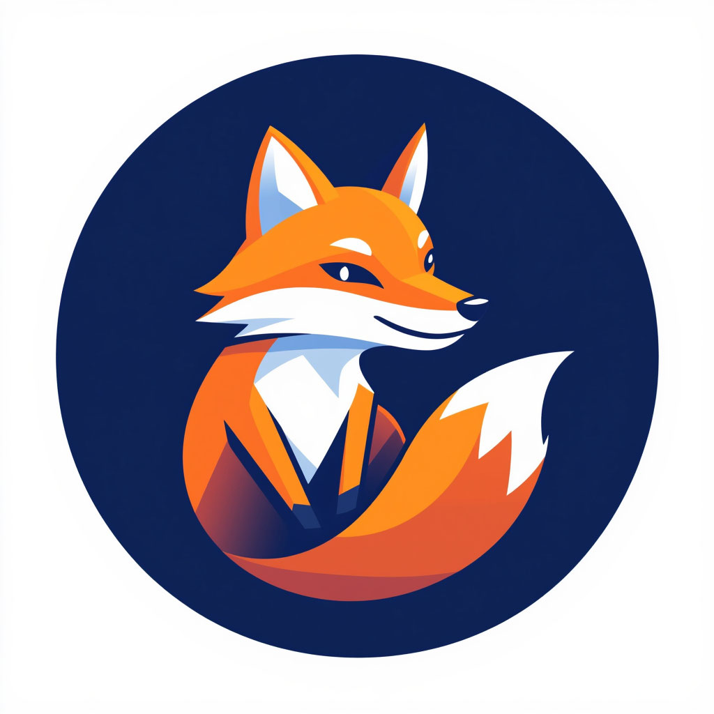

# 🦊 Foxy Programming Language

Foxy — это современный, быстрый и выразительный язык программирования, ориентированный на простоту написания читаемого кода.

## 🚀 Особенности
*   **Простой синтаксис:** Читабельность.
*   **Типизация:** Динамическая.
*   **Парадигмы:** Поддерживает функциональное программирование.

